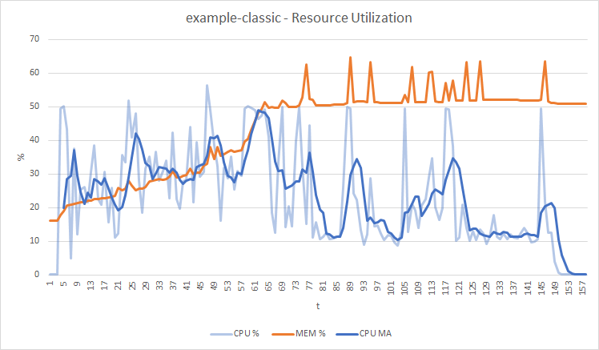

# Reactive vs Classic programming

## Description

The aim of this project is to compare performance and resources utilization of the same application implemented first with the classic Spring MVC approach, then with the Spring Web Flux approach. 

In this project you will find two maven project:

- example-classic
- example-reactive

Both implementing a web app exposing only one endpoint: /users. When invoked, the edpoint proxyes the results returned by https://gorest.co.in/public/v2/users

This scenario allows us to highlight the main benefits of the reactive programming paradigm, which is to reduce the amount of time wasted waiting for external resources to return the quiried data, while keeping the application simple enough. 

## Experimental Settings

To build and run each application, run the following commands:

```
cd example-classic #cd example-reactive
mvn clean package
docker compose up --build
```

The application will be executed within a docker container where the resources are limited as following:

```
    deploy:
        resources:
            limits:
              cpus: '0.5'
              memory: 512M
            reservations:
              cpus: '0.25'
              memory: 128M
```

The load test has been performed by using [artillery.io](https://www.artillery.io/) setting up a warm up pahase, a rump up phase from 2 to 100 vusers and a sustained load phase with 100 vusers ( as defined in [load test script](load-test-script.yaml)):
```
  phases:
  - duration: 10
    arrivalRate: 2
    name: Warm up
  - duration: 180
    arrivalRate: 2
    rampTo: 100
    name: Ramp up load
  - duration: 180
    arrivalRate: 100
    name: Sustained load
```

The resource utilization pieces of information have been collected by using `docke stats` by running the following command:
```
while true; do docker stats --no-stream | tee --append stats.txt; sleep 1; done
```

## Experimental Results

All the data collected during the experiments are in the "experiment-results" folder, where you can find:

- the original reports produced by artillery, both in json and html format
- the original resource utilization data extracted by docker
- a comparison in excel forma, where the following plots have been produced (I'm sorry for using excel!)

### Http Requests Execution time

|Application       | Min   |   Max | Median |
|------------------|-------|-------|--------|
|example-reactive  |158ms  |24954ms| 450ms  |
|example-classic   |158ms  |75438ms|1720ms  |

### Resource Utilization

Considering that the raw CPU utilization is not a reliale metric by itself to observe the behaviour of an application, in the following plot also its moving avarage with a period of 5 has been evaluated.




## Conclusions

The results obtained by onbserving the behavoir of both applications show that under a substained load the reactive implementaion is more consistent in the response time while consuming fewer resources both in terms of CPU and Memory. What is less evident and could deserve further investigations is the behavour of both application until t 80th where the CPU utilization appears to be higher then in the final part of the load test, while an opposite behavour would have been expected. 